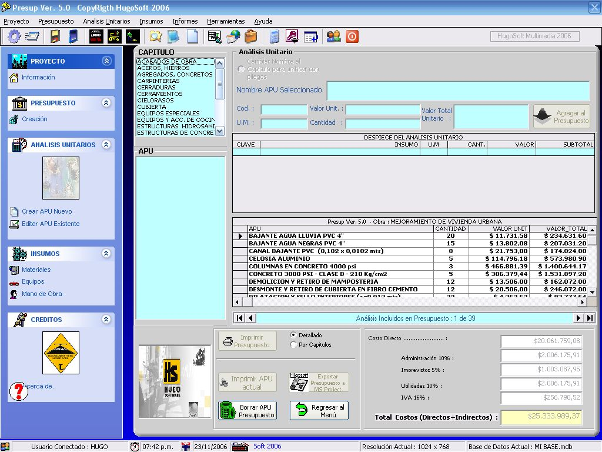



## PRESUPUESTOS V\.5

### Description

I CALCULATE OF BUDGETS OF IT WORKS CIVIL. IDEAL FOR ENGINEERS THAT MAKE CALCULATIONS TO ESTABLISH THE COST OF A WORK. MOST OF CONTROLS COPIED GRATUITOUSLY OF THIS WEB WERE KEY FOR THE CREATION OF THIS PROGRAM. THANKS TO OLIVER TORO AND TO OTHER PROGRAMMERS DE PSC THAT TAUGHT ME WITH ITS EXAMPLES AND TODAY APPLIES THESE TEACHINGS. THE OCX IS INCLUDED. - GREETINGS FROM BOGOT&#193;-COLOMBIA
 
### More Info
 

             |
---                |---
**Submitted On**   |2006-11-23 17:01:42
**By**             |[HUGO ALEXANDER TORRES](https://github.com/Planet-Source-Code/PSCIndex/blob/master/ByAuthor/hugo-alexander-torres.md)
**Level**          |Advanced
**User Rating**    |5.0 (25 globes from 5 users)
**Compatibility**  |VB 6\.0
**Category**       |[Complete Applications](https://github.com/Planet-Source-Code/PSCIndex/blob/master/ByCategory/complete-applications__1-27.md)
**World**          |[Visual Basic](https://github.com/Planet-Source-Code/PSCIndex/blob/master/ByWorld/visual-basic.md)
**Archive File**   |[PRESUPUEST20331611262006\.zip](https://github.com/Planet-Source-Code/hugo-alexander-torres-presupuestos-v-5__1-67197/archive/master.zip)

